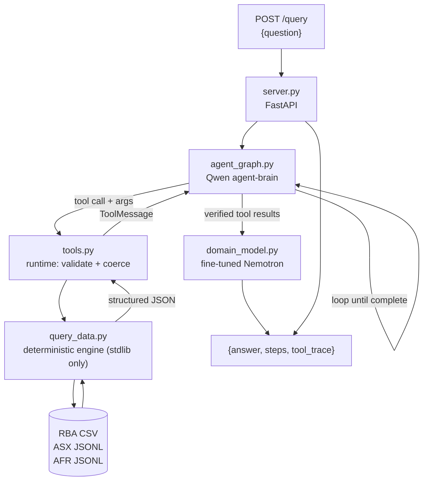

# Evidence-Grounded Market Signal Agent

A question-answering agent over the approved RBA, ASX, and AFR datasets. Every dataset-derived
number is computed by deterministic Python against the local files — no figure is ever recalled from
model memory.

The system implements the responsibility split mandated by
[Challenge Brief → Required Model Roles](Participant_Package/Challenge_Brief.md#required-model-roles):
**Qwen plans and emits tool calls, the application runtime executes them, and the fine-tuned
Nemotron model writes the final answer.**

- [Architecture](#architecture)
- [Repository Layout](#repository-layout)
- [Running the Agent](#running-the-agent)
- [API Contract](#api-contract)
- [Tool Reference](#tool-reference)
- [Determinism Rules](#determinism-rules)
- [Evaluation](#evaluation)
- [Fine-Tuned Model](#fine-tuned-model)
- [Known Limitations](#known-limitations)
- [Pre-Submission Checklist](#pre-submission-checklist)

---

## Architecture



| Component | File | Responsibility |
|---|---|---|
| Reasoning brain | [src/agent_graph.py](src/agent_graph.py) | Qwen (`BRAIN_MODEL`) plans the approach, selects a metric, emits tool calls and arguments, reads results, decides whether another call is needed. Not fine-tuned. Never writes the answer. |
| Tool runtime | [src/tools.py](src/tools.py) | Typed LangChain tool surface. Validates and coerces Qwen's arguments, executes the call, returns structured results. Errors are returned as data, never raised. |
| Deterministic engine | [src/query_data.py](src/query_data.py) | Pure-stdlib parsing and calculation over the local datasets. The only source of dataset-derived numbers. |
| Answer synthesis | [src/domain_model.py](src/domain_model.py) | Fine-tuned Nemotron (`DOMAIN_FT_MODEL`) receives the question plus accumulated verified tool results and writes the final `answer`. |
| API surface | [src/server.py](src/server.py) | `GET /health`, `POST /query`. Guarantees a valid non-empty `answer` on every path, including model or tool failure. |

### Why the models never do arithmetic

Qwen chooses *which* metric to call; `query_data.py` computes the number; Nemotron only phrases the
verified result. This is what makes answers reproducible: the organizers score by running the same
tool calls against the same data, so a calculation done inside a model — even a correct one — is
unverifiable and drifts between runs.

### Failure containment

An uncaught exception on `/query` returns HTTP 500 with no `answer` field, which the harness scores
as zero. Every failure path is therefore contained:

- A tool exception is caught in [tools.py](src/tools.py) and returned as `{"error", "hint",
  "metric_reference"}` so the brain can read the problem and retry with corrected arguments.
- A brain-loop failure is caught in [server.py](src/server.py); synthesis still runs on whatever
  tool results were collected.
- A synthesis failure falls back to the raw tool results, then to an explicit statement of the
  limitation. `answer` is never empty.

---

## Repository Layout

```text
.
├── README.md                  this file
├── submission.json            team identity, pinned commit, agent + model endpoints
├── requirements.txt           pinned Python dependencies
├── src/                       agent source
│   ├── server.py              FastAPI app: /health, /query
│   ├── agent_graph.py         Qwen planning / tool-calling loop (LangGraph)
│   ├── tools.py               typed tool surface over the deterministic engine
│   ├── query_data.py          deterministic RBA/ASX/AFR calculations (stdlib only)
│   ├── domain_model.py        fine-tuned Nemotron answer synthesis
│   ├── config.py              environment configuration
│   └── langgraph.json         LangGraph dev-server config
├── training/                  fine-tuning evidence, configs, metrics, comparison
├── tests/                     public-question regression tests
├── logs/                      non-sensitive evaluation logs and traces
├── data set/                  organizer-supplied datasets (not modified)
└── Participant_Package/       challenge materials and validation schema
```

---

## Running the Agent

### 1. Environment

Python 3.13. Install dependencies:

```bash
python -m venv .venv && source .venv/bin/activate
pip install -r requirements.txt
```

Create `.env` in the repository root (it is gitignored — never commit it):

```env
LITELLM_BASE_URL=http://<brain-node>:4000
LITELLM_KEY=<key>
BRAIN_MODEL=agent-brain

DOMAIN_BASE_URL=http://<model-node>:8001/v1
DOMAIN_KEY=<key>
DOMAIN_FT_MODEL=domain-ft
DOMAIN_PREDICT_MODE=llm

MAX_AGENT_STEPS=10
HACKATHON_DATA_DIR=/absolute/path/to/data set
```

`DOMAIN_PREDICT_MODE` must be `llm` for evaluation. The `mock` value is the documented cluster
bootstrap default and concatenates raw tool JSON instead of calling the fine-tuned model — shipping
with it loses both model-quality and architecture credit.

### 2. Serve

```bash
uvicorn server:app --app-dir src --host 0.0.0.0 --port 5000
```

Bind to `0.0.0.0`, not `localhost` — the organizer harness calls the agent from a different machine.

### 3. Interactive graph development (optional)

```bash
./src/run-langgraph-dev.sh
```

Opens the LangGraph dev server for stepping through the brain's tool-calling loop.

### 4. Verify

```bash
python tests/test_public.py        # engine reproduces all 15 public reference answers
curl -s localhost:5000/health
curl -s localhost:5000/query -H 'Content-Type: application/json' \
  -d '{"question":"From the first RBA record to the last, how many cash-rate decisions changed the rate?"}'
```

---

## API Contract

### `GET /health`

Returns HTTP 200. This is a hard gate — if it fails during the pre-evaluation check the team is
skipped and scores zero on the hidden questions.

```json
{"status": "ok"}
```

### `POST /query`

```json
{"question": "Excluding Tabcorp, which ticker had the best and worst 2018 return?"}
```

Returns a response validated against
[Participant_Package/validate.json](Participant_Package/validate.json):

```json
{
  "answer": "Excluding Tabcorp, BHP.AX had the best 2018 return at +22.17%, and AMP.AX had the worst at -50.04%.",
  "steps": 2,
  "tool_trace": [
    {
      "tool": "query_data",
      "args": {"dataset": "asx", "metric": "rank_annual_returns", "year": 2018},
      "result": "{\"best\": {\"ticker\": \"BHP.AX\", \"return_pct\": 22.17}, ...}"
    }
  ]
}
```

Only `answer` is graded. `steps` and `tool_trace` are organizer diagnostics — they are also the
evidence that Qwen planned the call and the runtime executed it, so they are always populated.

The harness sends up to three concurrent requests. The agent holds no per-request mutable state:
the LangGraph graph is stateless, dataset caches in `query_data.py` are read-only after load, and
each request carries its own message list.

---

## Tool Reference

Two tools are exposed to the brain. Both return JSON strings; both return `{"error": ...}` rather
than raising, so a bad call is recoverable inside the loop.

### `query_data(dataset, metric, ...)`

| Dataset | Metrics |
|---|---|
| `rba` | `count`, `count_changes`, `count_increases`, `count_decreases`, `extremes`, `lookup_rate`, `max_hold_streak`, `period_summary`, `list` |
| `asx` | `dimensions`, `annual_return`, `full_sample_return`, `rank_annual_returns`, `rank_full_sample_returns`, `avg_volume`, `max_drawdown`, `window_return`, `basket_window_return`, `volatility`, `correlation`, `quote` |
| `afr` | `count`, `count_year`, `count_by_year`, `count_by_month`, `peak_year_and_month`, `share`, `find_article` |
| `meta` | `coverage` — dataset date ranges, for "can the data support this?" questions |

Arguments are flat and typed (`ticker`, `year`, `pattern`, `start`, `end`, …) rather than a nested
blob, so the brain can express the call it wants. The runtime coerces types before dispatch: vLLM's
`qwen3_xml` tool-call parser extracts every `<parameter=...>` value as a string, so `year` arrives
as `"2018"` and `exclude_tabcorp` as `"true"`.

### `afr_get_article(headline, date)`

Fetches one AFR article's text for sentiment questions. Matching is paraphrase-tolerant
(stopword-stripped token overlap with light finance-synonym expansion, headline weighted 3×, anchored
by publication date when supplied), so an approximate headline still resolves.

---

## Determinism Rules

These are non-negotiable for reproducibility — the organizers score by re-running the same
calculations, so a different search scope or field set will not match the reference answers.

| Rule | Detail |
|---|---|
| Tabcorp exclusion | `TAH.AX` is excluded from ASX rankings, baskets, averages, and extremes unless the question explicitly includes it. Its +2,660% full-sample return is a flagged data artifact that also skews average volume. |
| ASX returns | First-to-last **close**, simple return `((last/first) - 1) × 100`. |
| Basket | Arithmetic mean of the 17 non-Tabcorp constituents' individual returns. |
| Max drawdown | `min` over rows of `(close / running_peak - 1)`, reporting peak and trough dates. |
| AFR search | Case-insensitive, across `HEADLINE + SUBHEAD + INTRO + TEXT` combined, counted **once per record**. Whole-word counts require `\b` anchors. |
| RBA rate in force | The `Cash rate target%` of the latest row with `Effective Date <= D`. |
| Tolerances | Dates, counts, rates, rankings exact; returns/drawdowns/volatility/shares ±0.02pp; correlations ±0.001; closes ±0.0001; average volume ±1 share. |

---

## Evaluation

### Engine regression

[tests/test_public.py](tests/test_public.py) asserts that `query_data` reproduces the exact figures
in all 15 public reference answers, at the tolerances above. This runs without any model server.

```bash
python tests/test_public.py
```

### End-to-end

The full pipeline is run against the 15 public calibration questions and the per-question trace is
written to [logs/langchain_public_eval.json](logs/langchain_public_eval.json), including the tool
calls made and the answer produced.

The public questions are calibration cases only — no question-ID-specific answers are hard-coded
anywhere in the agent.

---

## Fine-Tuned Model

`Llama-3.1-Nemotron-Nano-8B-v1` fine-tuned with LoRA for grounded financial answer synthesis, served
by vLLM and reached through `DOMAIN_FT_MODEL`. Training data preparation, configuration,
checkpoint selection, metrics, and the base-versus-fine-tuned comparison are documented in
[training/README.md](training/README.md).

---

## Known Limitations

Documented honestly rather than hidden; each is a known gap, not an unknown one.

**Runtime**

- No end-to-end deadline. Model calls have no explicit timeout, so a slow brain loop can cross the
  60-second penalty threshold on multi-part questions.
- If the brain loop raises mid-run, tool results already collected inside the graph are lost —
  synthesis then runs with no evidence. Streaming the graph and accumulating messages incrementally
  would preserve partial evidence.
- Dataset caches load lazily. The first AFR question pays roughly 2.5 s to parse the 780 MB corpus.

**Tool layer**

- Metrics accept and silently ignore parameters they do not use — for example
  `rba/count_decreases(year=2019)` returns the all-time count with no error. Per-metric argument
  validation is needed.
- No metric returns the basket's average *annual* return, and the ticker universe cannot be
  enumerated from a tool, so the brain has no grounded route to either.
- `find_article` truncates article text to 4,000 characters, which can drop sentiment evidence.
- 92 AFR records have a blank `PUBLICATIONDATE` and form an empty-string bucket in
  `count_by_year` / `count_by_month`.
- Window returns silently snap to the nearest available trading day when the requested date is a
  market holiday, without reporting the dates actually used.

**Coverage**

- ASX and AFR end December 2021 while RBA runs to 2026. Questions requiring ASX or AFR observations
  after 2021 are correctly answered as unsupported rather than estimated — see
  `query_data(dataset="meta", metric="coverage")`.
- Sentiment classification is performed on article text by the models; it is the one output not
  derived from a deterministic calculation.

---

## Pre-Submission Checklist

Run `python scripts/preflight.py` to check most of these mechanically.

- [ ] `submission.json` contains real team ID, name, public GitHub URL, and the exact commit SHA
- [ ] `agent.endpoint` uses the assigned IP, not `localhost`, and is reachable from another machine
- [ ] `GET /health` returns HTTP 200 from a different machine
- [ ] `POST /query` returns schema-valid JSON containing a non-empty `answer`
- [ ] `DOMAIN_PREDICT_MODE=llm` and the adapter is served
- [ ] Three concurrent `/query` requests return correct, unmixed responses
- [ ] `training/` contains data prep, config, metrics, and the base-vs-fine-tuned comparison
- [ ] No credentials, keys, or hidden evaluation data in any committed file
