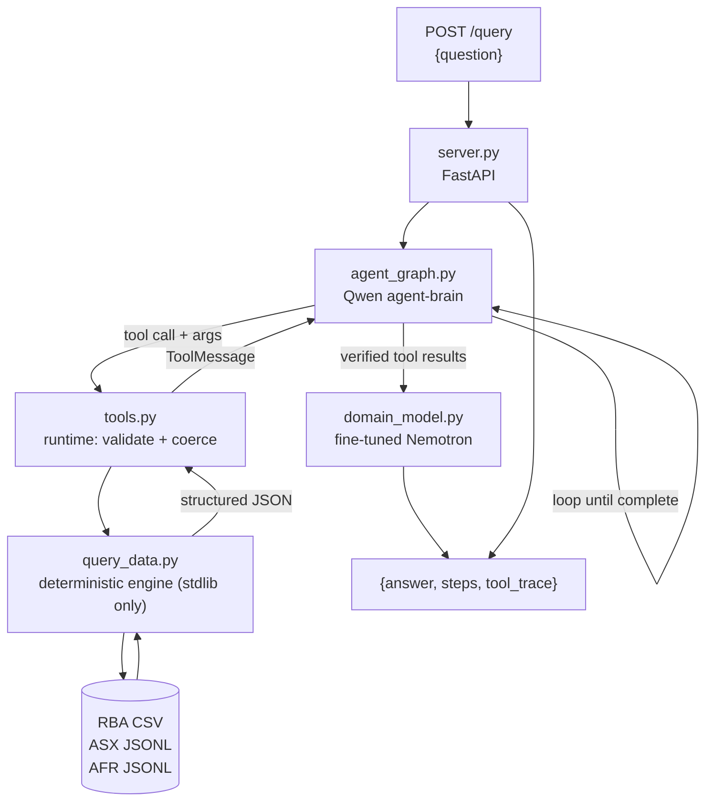

# Evidence-Grounded Market Signal Agent

A question-answering agent over the approved RBA, ASX, and AFR datasets. Every dataset-derived
number is computed by deterministic Python against the local files — no figure is ever recalled from
model memory.

The system implements the responsibility split mandated by
[Challenge Brief → Required Model Roles](Participant_Package/Challenge_Brief.md#required-model-roles):
**Qwen plans and emits tool calls, the application runtime executes them, and the fine-tuned
Nemotron model writes the final answer.**

- [Architecture](#architecture)
- [Repository Layout](#repository-layout)
- [Running the Agent](#running-the-agent)
- [API Contract](#api-contract)
- [Tool Reference](#tool-reference)
- [Determinism Rules](#determinism-rules)
- [Evaluation](#evaluation)
- [Fine-Tuned Model](#fine-tuned-model)
- [Known Limitations](#known-limitations)
- [Pre-Submission Checklist](#pre-submission-checklist)

---

## Architecture



| Component | File | Responsibility |
|---|---|---|
| Reasoning brain | [src/agent_graph.py](src/agent_graph.py) | Qwen (`BRAIN_MODEL`) plans the approach, selects a metric, emits tool calls and arguments, reads results, decides whether another call is needed. Not fine-tuned. Never writes the answer. |
| Tool runtime | [src/tools.py](src/tools.py) | Eleven task-shaped LangChain tools plus a raw fallback. Validates and coerces Qwen's arguments, executes the call, returns structured results. Errors are returned as data, never raised. |
| Deterministic engine | [src/query_data.py](src/query_data.py) | Pure-stdlib parsing and calculation over the local datasets. The only source of dataset-derived numbers. |
| Result formatting | [src/summaries.py](src/summaries.py) | Turns each engine result into a judge-ready `summary` sentence and a `must_state` fact list, so number formatting is deterministic rather than left to an 8B model. |
| Answer synthesis | [src/domain_model.py](src/domain_model.py) | Fine-tuned Nemotron (`DOMAIN_FT_MODEL`) receives the question plus accumulated verified tool results and writes the final `answer`. |
| API surface | [src/server.py](src/server.py) | `GET /health`, `POST /query`. Guarantees a valid non-empty `answer` on every path, including model or tool failure. |

### Why the models never do arithmetic

Qwen chooses *which* metric to call; `query_data.py` computes the number; Nemotron only phrases the
verified result. This is what makes answers reproducible: the organizers score by running the same
tool calls against the same data, so a calculation done inside a model — even a correct one — is
unverifiable and drifts between runs.

### Response-time budget

Scoring is time-sensitive: full points at ≤60 s, a 20% deduction beyond it, zero past 300 s. The
request therefore runs against a wall-clock budget rather than finishing whenever it finishes.

```text
REQUEST_DEADLINE_S = 55           total target, under the 60s full-credit threshold
├── brain loop      40s           REQUEST_DEADLINE_S - SYNTH_RESERVE_S
└── synthesis       15s reserve   never starved, min SYNTH_MIN_S even if the brain overran
```

The brain loop is **streamed**, not awaited as a single call. `ainvoke` returns the final state or
nothing at all, so a failure at step 5 discards the tool results from steps 1–4 and synthesis runs
with no evidence — turning a partial score into a zero. Streaming keeps the latest state after every
step, so a timeout or a crash still leaves usable evidence to answer from.

Synthesis is guaranteed a minimum slice even when the brain overran the budget. That can push a
request past 60 s and take the 20% penalty, and it is deliberate: a real answer minus 20% scores far
better than a fast answer made of raw JSON.

### Failure containment

An uncaught exception on `/query` returns HTTP 500 with no `answer` field, which the harness scores
as zero. Every failure path is therefore contained:

- A tool exception is caught in [tools.py](src/tools.py) and returned as `{"error", "hint", ...}` so
  the brain can read the problem and retry with corrected arguments.
- A brain-loop timeout or crash is caught in [agent_graph.py](src/agent_graph.py) and returns a
  `BrainRun` carrying the partial message state; synthesis runs on whatever evidence exists.
- A synthesis timeout or failure falls back to the raw tool results, then to an explicit statement
  of the limitation. `answer` is never empty.
- Every degradation is recorded in `tool_trace` under an underscore-prefixed pseudo-tool
  (`_brain_timeout`, `_synth_timeout`, …), which keeps it out of the evidence passed to synthesis
  while leaving it visible in organizer diagnostics.

---

## Repository Layout

```text
.
├── README.md                  this file
├── submission.json            team identity, pinned commit, agent + model endpoints
├── requirements.txt           pinned Python dependencies
├── src/                       agent source
│   ├── server.py              FastAPI app: /health, /query
│   ├── agent_graph.py         Qwen planning / tool-calling loop (LangGraph)
│   ├── tools.py               typed tool surface over the deterministic engine
│   ├── query_data.py          deterministic RBA/ASX/AFR calculations (stdlib only)
│   ├── summaries.py           judge-ready formatting of engine results
│   ├── domain_model.py        fine-tuned Nemotron answer synthesis
│   ├── config.py              environment configuration
│   └── langgraph.json         LangGraph dev-server config
├── training/                  fine-tuning evidence, configs, metrics, comparison
├── tests/                     public-question regression tests
├── logs/                      non-sensitive evaluation logs and traces
├── data set/                  organizer-supplied datasets (not modified)
└── Participant_Package/       challenge materials and validation schema
```

---

## Running the Agent

### 1. Environment

Python 3.13. Install dependencies:

```bash
python -m venv .venv && source .venv/bin/activate
pip install -r requirements.txt
```

Create `.env` in the repository root (it is gitignored — never commit it):

```env
LITELLM_BASE_URL=http://<brain-node>:4000
LITELLM_KEY=<key>
BRAIN_MODEL=agent-brain

DOMAIN_BASE_URL=http://<model-node>:8001/v1
DOMAIN_KEY=<key>
DOMAIN_FT_MODEL=domain-ft
DOMAIN_PREDICT_MODE=llm

MAX_AGENT_STEPS=10
HACKATHON_DATA_DIR=/absolute/path/to/data set

# Response-time budget (seconds). Defaults shown; see Response-Time Budget below.
REQUEST_DEADLINE_S=55
SYNTH_RESERVE_S=15
SYNTH_MIN_S=12
BRAIN_TIMEOUT_S=30
SYNTH_TIMEOUT_S=20
```

`DOMAIN_PREDICT_MODE` must be `llm` for evaluation. The `mock` value is the documented cluster
bootstrap default and concatenates raw tool JSON instead of calling the fine-tuned model — shipping
with it loses both model-quality and architecture credit.

### 2. Serve

```bash
uvicorn server:app --app-dir src --host 0.0.0.0 --port 5000
```

Bind to `0.0.0.0`, not `localhost` — the organizer harness calls the agent from a different machine.

### 3. Interactive graph development (optional)

```bash
./src/run-langgraph-dev.sh
```

Opens the LangGraph dev server for stepping through the brain's tool-calling loop.

### 4. Verify

```bash
python tests/test_public.py        # engine reproduces all 15 public reference answers
curl -s localhost:5000/health
curl -s localhost:5000/query -H 'Content-Type: application/json' \
  -d '{"question":"From the first RBA record to the last, how many cash-rate decisions changed the rate?"}'
```

---

## API Contract

### `GET /health`

Returns HTTP 200. This is a hard gate — if it fails during the pre-evaluation check the team is
skipped and scores zero on the hidden questions.

```json
{"status": "ok"}
```

### `POST /query`

```json
{"question": "Excluding Tabcorp, which ticker had the best and worst 2018 return?"}
```

Returns a response validated against
[Participant_Package/validate.json](Participant_Package/validate.json):

```json
{
  "answer": "Excluding Tabcorp, BHP.AX had the best 2018 return at +22.17%, and AMP.AX had the worst at -50.04%.",
  "steps": 2,
  "tool_trace": [
    {
      "tool": "query_data",
      "args": {"dataset": "asx", "metric": "rank_annual_returns", "year": 2018},
      "result": "{\"best\": {\"ticker\": \"BHP.AX\", \"return_pct\": 22.17}, ...}"
    }
  ]
}
```

Only `answer` is graded. `steps` and `tool_trace` are organizer diagnostics — they are also the
evidence that Qwen planned the call and the runtime executed it, so they are always populated.

The harness sends up to three concurrent requests. The agent holds no per-request mutable state:
the LangGraph graph is stateless, dataset caches in `query_data.py` are read-only after load, and
each request carries its own message list.

---

## Tool Reference

Eleven task-shaped tools plus one fallback, defined in [src/tools.py](src/tools.py). Each covers a
single question family with a closed argument set, so an invalid call is largely unrepresentable.
All of them route through the one deterministic entry point `query_data.query_data()`, so there is
exactly one code path to the data.

| Tool | Answers |
|---|---|
| `rba_rate_on_date(date)` | The cash-rate target in force **on** a date — the latest decision at or before it, never the nearest. |
| `rba_rate_changes(start_year?, end_year?)` | Change/increase/decrease counts across the dataset, or a cycle's cuts, hikes, split by year, cumulative move, and endpoint targets. |
| `rba_rate_extremes()` | Highest and lowest targets, each with first effective date, board decision date, and record count. |
| `rba_longest_hold()` | Longest stretch between non-zero changes: days, both dates, rate held, rate after. |
| `asx_returns(scope, …)` | First-to-last close returns for `ticker`, `basket`, or a full `ranking`, over a year, a window, or the full sample. |
| `asx_risk(measure, …)` | Maximum drawdown (single or ranked, with peak and trough dates), volatility, or pairwise correlation. |
| `asx_market_data(measure, …)` | An exact OHLCV row, or the average-daily-volume ranking. |
| `asx_event_study(event_dates, …)` | Reaction to dated events: rate in force, session window, basket return and per-ticker returns, for any number of events **in one call**. |
| `afr_count(pattern\|preset, group_by, year?)` | Article counts — total, by year, by month, peak year *and* month together, or share of records. |
| `afr_find_article(headline, date?)` | One article's full text for sentiment questions; paraphrase-tolerant matching. |
| `dataset_coverage()` | Shape and date range of all three datasets, and whether a question is answerable at all. |
| `query_data(dataset, metric, params)` | **Fallback.** Raw engine access for question families the tools above do not anticipate. |

### Why task-shaped tools rather than one `query_data(dataset, metric, …)`

The handout's reference interface is a single tool with a free-text `metric` and a bag of optional
parameters. That shape makes the brain guess two things at once — which metric names exist, and
which parameters pair with each — and on the public set it guessed wrong in ways that cost real
points: MHQ084 invented its own AFR regex and returned 1,283 where the reference is 3,181.

Narrow tools with `Literal` enums remove that discretion. The fallback stays registered last because
roughly 75 of the ~90 benchmark questions are unseen, and a question family we did not anticipate
should degrade to a raw engine call rather than to no answer at all.

### What every tool returns

JSON with the computed fields plus two presentation keys built in [src/summaries.py](src/summaries.py):

- **`summary`** — one judge-ready sentence, already signed, rounded and separated the way the
  reference answers write it (`+22.17%`, `11,635,671.71`, `0.10%`, `3 Nov 2010`).
- **`must_state`** — the individual facts the answer has to contain. [src/domain_model.py](src/domain_model.py)
  turns this into an explicit checklist in the synthesis prompt.

Formatting is deliberately owned by the deterministic layer rather than by an 8B model. Our public-set
losses were overwhelmingly omissions, not miscalculations — MHQ001 computed 41/20/21 correctly but
dropped "of the 175 records"; MHQ074 computed all three basket returns but never stated the resulting
targets. The fine-tuned Nemotron still writes the answer; it just never has to invent a number or a
format.

### Argument handling

vLLM's `qwen3_xml` tool-call parser extracts every `<parameter=…>` value as a **string**, so `year`
arrives as `"2018"`, `exclude_tabcorp` as `"true"`, and a list as `"CBA,NAB"` or `"['CBA','NAB']"`.
List fields coerce in a `mode="before"` Pydantic validator, so they never fail schema validation and
cost a retry. Ticker aliases (`rio tinto` → `RIO.AX`), date spellings (`23 Feb 2021`, `20210223`,
`2021-02-23`) and bare AFR terms (`QBE` → `\bQBE\b`) are normalised into the exact forms the
reference answers were computed with.

Failures return `{"error", "hint", <arguments as received>}`. LangGraph's `ToolNode` would already
convert an exception into a `ToolMessage`, but a raw traceback tells the brain nothing about how to
fix the call — and every wasted retry is another round trip against the 60-second budget.

---

## Determinism Rules

These are non-negotiable for reproducibility — the organizers score by re-running the same
calculations, so a different search scope or field set will not match the reference answers.

| Rule | Detail |
|---|---|
| Tabcorp exclusion | `TAH.AX` is excluded from ASX rankings, baskets, averages, and extremes unless the question explicitly includes it. Its +2,660% full-sample return is a flagged data artifact that also skews average volume. |
| ASX returns | First-to-last **close**, simple return `((last/first) - 1) × 100`. |
| Basket | Arithmetic mean of the 17 non-Tabcorp constituents' individual returns. |
| Max drawdown | `min` over rows of `(close / running_peak - 1)`, reporting peak and trough dates. |
| AFR search | Case-insensitive, across `HEADLINE + SUBHEAD + INTRO + TEXT` combined, counted **once per record**. Whole-word counts require `\b` anchors. |
| RBA rate in force | The `Cash rate target%` of the latest row with `Effective Date <= D`. |
| Tolerances | Dates, counts, rates, rankings exact; returns/drawdowns/volatility/shares ±0.02pp; correlations ±0.001; closes ±0.0001; average volume ±1 share. |

---

## Evaluation

### Engine regression

[tests/test_public.py](tests/test_public.py) asserts that `query_data` reproduces the exact figures
in all 15 public reference answers, at the tolerances above — 54 checks. This runs without any model
server.

```bash
python tests/test_public.py
```

### Tool surface

[tests/test_tools.py](tests/test_tools.py) tests the layer the *model* actually touches: that each
public question is answerable through its intended tool, that every reference fact reaches the
`summary`/`must_state` text the synthesis model reads, that arguments survive the string-typed shapes
vLLM's XML parser produces, and that bad calls return readable errors instead of raising — 39 checks,
also model-free.

```bash
python tests/test_tools.py
```

### Tool evidence ceiling

[training/eval/tool_evidence_audit.py](training/eval/tool_evidence_audit.py) answers a question an
end-to-end score cannot: *do the tools actually supply every fact the judge asks for?* It executes
the tools each public question should route to, and grades the `summary`/`must_state` text they
produce with the same component grader used on real runs.

```bash
python training/eval/tool_evidence_audit.py
```

Current result: **88.4% from tool evidence alone, 100% once the components that are a model
judgement** — sentiment labels, market direction, the supported/unsupported verdict — **are
included**, at 1.47 tool calls per question. There is no tool-layer gap, so every remaining
end-to-end loss is routing or synthesis, and building more tools would not recover it.

### Context budget

The brain is served with a **4,096-token window**, shared between the system prompt, the tool
schemas, the question, every tool result replayed each turn, and the reply. Tool schemas are
therefore a per-request cost, and [tests/test_tools.py](tests/test_tools.py) asserts the fixed
overhead stays under 2,600 tokens (currently ~2,363: ~2,033 of schema, ~330 of prompt) and that no
single tool result exceeds 500 tokens.

This is not theoretical. An untrimmed version of the toolkit cost ~3,750 tokens of overhead; every
request then failed with `400 maximum context length is 4096`, and the agent scored **12.4%** while
every unit test still passed, because the tools themselves were correct.

### Brain latency — thinking mode is off

The served brain generates at roughly **21 tokens/second**, so latency is governed by how many
tokens it *emits*, not by how long the prompt is. Qwen3 emits a hidden reasoning block before its
visible output, and measured on this model that cost:

| | Output tokens |
|---|---:|
| Producing one tool call | 503 |
| Producing the word `"done"` | 190 |

About 35 seconds per question against a 40-second brain budget. Under the three concurrent requests
the harness sends, 8 of 15 public questions hit `_brain_timeout` having completed **zero** tool
calls — and synthesis then invented figures from the empty evidence.

[src/agent_graph.py](src/agent_graph.py) therefore sends
`chat_template_kwargs={"enable_thinking": false}`, which took a representative call from 17.3 s to
1.7 s and brain output from ~693 tokens per question to ~160–290. `reasoning_effort: "none"` was
measured to have no effect on this server; only the chat-template switch works. Set
`BRAIN_THINKING=1` to measure it back on.

The planner does not need chain-of-thought: it selects a named tool and its arguments, and the
deterministic layer performs every calculation.

### Runtime behaviour

[tests/test_runtime.py](tests/test_runtime.py) covers the paths that never execute during a healthy
dev loop and are therefore most likely to be broken when they matter: a brain loop that overruns the
budget, one that crashes halfway, a synthesis call that hangs, and three requests in flight at once.
The brain graph and the synthesis call are replaced with controllable fakes, so this tests the
orchestration — not the agent.

```bash
python tests/test_runtime.py
```

### End-to-end

[scripts/eval_public.py](scripts/eval_public.py) is the only check that exercises the whole
submitted pipeline the way the organizers will — over HTTP against the running agent, with Qwen
planning, the runtime executing tools, and the fine-tuned Nemotron writing the answer.

```bash
uvicorn server:app --app-dir src --port 5000     # in another shell
python scripts/eval_public.py
python scripts/eval_public.py --concurrency 3    # mirror the harness default
python scripts/eval_public.py --ids MHQ074 --verbose
```

It scores the way the harness scores: component-based partial credit **plus the response-time
penalty**, which is part of the real score and invisible if you only look at correctness. It also
reports how many answers were produced from **zero tool results** — an ungrounded answer can still
score by coincidence when a generic refusal happens to satisfy a label-only component, so a run with
any ungrounded answers is reported as invalid and exits non-zero.

Results are written to [logs/langchain_public_eval.json](logs/langchain_public_eval.json) (the
recorded run, also replayed as fixed evidence by the base-vs-fine-tuned comparison) and
`logs/public_eval_summary.md`. Note that a run **overwrites** the recorded log — keep a copy if the
current one is the last known-good pipeline trace.

### Measuring a change

Grade any two recorded runs with the same grader and the difference is attributable to whatever
changed between them:

```bash
python training/eval/grade_components.py logs/public_eval_baseline_old_toolkit.json
python training/eval/grade_components.py logs/langchain_public_eval.json
```

[logs/public_eval_baseline_old_toolkit.json](logs/public_eval_baseline_old_toolkit.json) is kept as
the reference point: the pipeline as it scored with the previous two-tool interface, **72.7%**.
Replacing that with the task-shaped toolkit, the trimmed prompts, and the deterministic
`summary`/`must_state` formatting moved the same 15 questions to **89.2%**.

The grader is deliberately stricter than the organizers' LLM judge — it requires every anchor in an
expected fact, including signs. Read it as an A/B instrument, not as a predicted leaderboard score.

The public questions are calibration cases only — no question-ID-specific answers are hard-coded
anywhere in the agent.

---

## Fine-Tuned Model

`Llama-3.1-Nemotron-Nano-8B-v1` fine-tuned with LoRA for grounded financial answer synthesis, served
by vLLM and reached through `DOMAIN_FT_MODEL`. Training data preparation, configuration,
checkpoint selection, metrics, and the base-versus-fine-tuned comparison are documented in
[training/README.md](training/README.md).

---

## Known Limitations

Documented honestly rather than hidden; each is a known gap, not an unknown one.

**Runtime**

- **Brain context window.** The served brain reports `max_model_len=4096`, while the system prompt
  plus the tool schemas already cost roughly 3,750 tokens — leaving almost nothing for the question,
  the tool results, and the reply. Requests fail with HTTP 400 until the brain is served with a
  larger `--max-model-len` or the tool surface is trimmed.
- The deadline is wall-clock, not per-component. When it expires the answer is synthesized from
  partial evidence, so it will be missing components — partial credit, not full.
- Synthesis is guaranteed a minimum slice even if that pushes the request past 60 s and into the
  20% slow-penalty. This is a deliberate trade against returning raw tool JSON.
- No grounding verification: figures in the final answer are not checked back against the tool
  results, so a synthesis model that invents a number is not caught.

**Tool layer**

- Metrics accept and silently ignore parameters they do not use — for example
  `rba/count_decreases(year=2019)` returns the all-time count with no error. Per-metric argument
  validation is needed.
- No metric returns the basket's average *annual* return, so the brain has no grounded route to it.
- `find_article` truncates article text to 4,000 characters, which can drop sentiment evidence.
- 92 AFR records have a blank `PUBLICATIONDATE` and form an empty-string bucket in
  `count_by_year` / `count_by_month`.
- Window returns silently snap to the nearest available trading day when the requested date is a
  market holiday, without reporting the dates actually used.

**Coverage**

- ASX and AFR end December 2021 while RBA runs to 2026. Questions requiring ASX or AFR observations
  after 2021 are correctly answered as unsupported rather than estimated — see
  `query_data(dataset="meta", metric="coverage")`.
- Sentiment classification is performed on article text by the models; it is the one output not
  derived from a deterministic calculation.

---

## Pre-Submission Checklist

Run `python scripts/preflight.py` to check most of these mechanically.

- [ ] `submission.json` contains real team ID, name, public GitHub URL, and the exact commit SHA
- [ ] `agent.endpoint` uses the assigned IP, not `localhost`, and is reachable from another machine
- [ ] `GET /health` returns HTTP 200 from a different machine
- [ ] `POST /query` returns schema-valid JSON containing a non-empty `answer`
- [ ] `DOMAIN_PREDICT_MODE=llm` and the adapter is served
- [ ] Three concurrent `/query` requests return correct, unmixed responses
- [ ] `training/` contains data prep, config, metrics, and the base-vs-fine-tuned comparison
- [ ] No credentials, keys, or hidden evaluation data in any committed file
